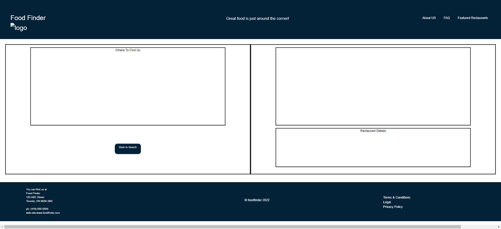

# Food Finder page 2 - comments

## content

added content for now; styling to be added after coordinating with Matthew on Home page.  For a rough template, mainly to provide an idea of where information pulled from the API call could go, I've included a screenshot of the webpage as it would appear based on the coding in the CSS stylesheet that was removed.  

## header

Assume Matthew created header with similar set-up and will coordinate.  created 3 divs, one for site name (class="name"), one for whatever tag line we use (class="tagline") and one for a navigation menu, should we want want.  For now, I've moved the logo div (class="logo") to the one with the name.

## Main

set up in 2 main div containers:

1. left container having class of "col-6 col-md-3" and id of "directions-container" for the map insert (id is "to-find-us" and class="here-we-are") and a button to return to homepage (class="return-button" for div and "btn back" for actual button).

2. right container having class of "col-6" and id of "restaurant-container" for an image of the restaurant (class of "restaurant-image) with an url of the restaurant embedded in the image (class of "restaurant link") and maybe a small excerpt about the restaurant if available through the api call (class of "restaurant-details") or maybe directions for walking for people who can't read maps?

## footer

I've included divs as placeholders for the footer with classes of "contact-info", "copyright" and "legal".
