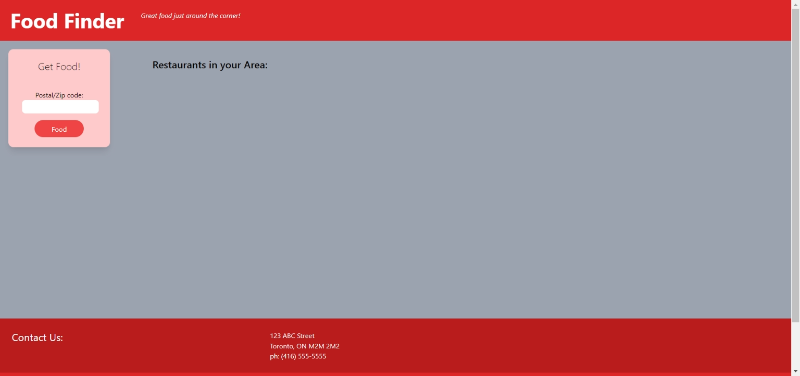
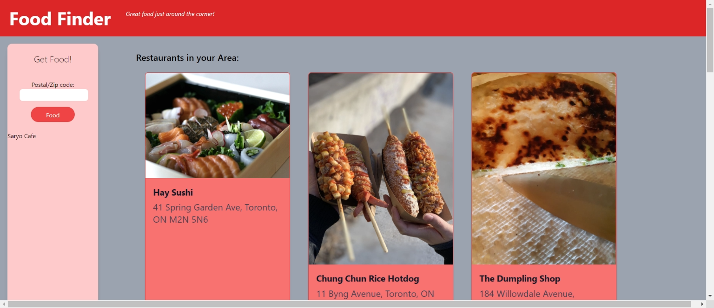
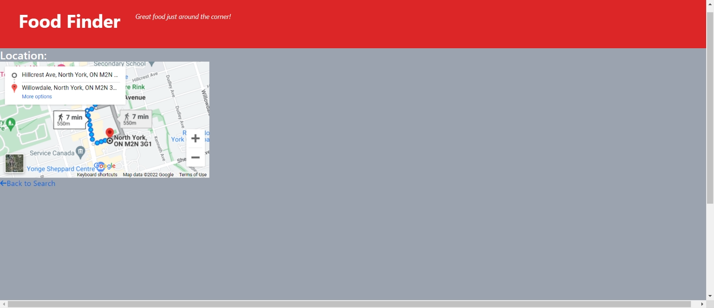

# Food Finder

Many people often take where they live for granted, even in urban locales surrounded by stores and restaurants and can end up missing out on some nearby neighbourhood gems.  Or perhaps they just don't want to get in a car, or Uber, to dine out at one of the better known restaurants. The purpose of our product is to provide the user with options for great restaurants within a convenient walking distance from their home; just around the corner.

## Built With

- HTML
- Tailwind CSS
- Javascript
- Yelp Fusion API
- Openrouteservice API
- Google Maps API

## Deployment

This site has been published via [Github Pages](https://bootcampProjectOneTeamFour.github.io/food-finder/)
The repository has been stored on [Github](https://github.com/bootcampProjectOneTeamFour/food-finder)

## Design and Functionality

The main design uses a combination of HTML, CSS and Javascript.

1/ The user inputs their postal code into the search field and then clicks on the "Food" button.

2/ The button click calls the function that pulls information from the Yelp Fusion API display the top 10 rated restaurants in the user's area.

3/ When the user clicks on the restaurant button, that click calls the function that pulls information from a combination of the Open Route API, and Google Maps to display walking directions to that restaurant.

4/ At the same time, the button click saves the user's search history into local storage so that when the user returns to the restaurant directory, the user's search history will be displayed.

![screenshot of homepage showing previous searches retrieved from local storage]

## License

An MIT [License](LICENSE) has been included with this project.

## Credits and external Resources

- Yelp Fusion - <https://fusion.yelp.com/>
- Openrouteservice - <https://openrouteservice.org/services/>
- Google Maps - <https://developers.google.com/maps/documentation/directions>

## Future Developments

- When the user searches by postal code, they are shown a map of the top 10 best rated restaurants in that area
- When a user clicks on the pin for that restaurant, they are shown a badge. If the user clicks on that badge, they are directed towards the restaurant’s website.

## Project Contributors

- Ian Ackerman (<https://github.com/ianaack>)
- Laurel David (<https://github.com/lnd4812>)
- Tommy Otis (<https://github.com/xdatalinq>)
- Matthew Smith (<https://github.com/mdubb23>)
- Feven Tsegai (<https://github.com/feventsegai>)
